# 🎯 Academic Radar

An intelligent, multi-agent research pipeline that discovers **isomorphic contributions** across scientific domains.

## 🌟 What Makes This Different?

Academic Radar doesn't just search for papers in your field—it finds solutions from **completely different domains** that solve your specific mathematical constraints. 

**Example:** If you're working on traffic flow optimization with memory bottlenecks, it might discover tensor decomposition techniques from video compression research.

## 🏗️ Architecture

Built on **LangGraph** with 5 specialized agents:

1. **🧬 The Profiler** - Extracts your research DNA from PDFs
2. **🎨 The Abstractor** - Generates cross-domain search queries
3. **🔍 The Scout** - Searches OpenAlex with intelligent filtering
4. **🔬 The Analyst** - Evaluates methodological "borrowability"
5. **📧 The Publisher** - Delivers insights via email

### 📊 LangGraph Workflow

```mermaid
graph TD
    START([START]) --> PROFILER[🧬 Profiler Agent]
    
    PROFILER --> CHECK_PROFILE{Profile<br/>Exists?}
    CHECK_PROFILE -->|No Profile| EXTRACT[Extract from PDFs]
    CHECK_PROFILE -->|Cached| LOAD[Load profile.json]
    EXTRACT --> CACHE[Cache to profile.json]
    LOAD --> CHECK_MODE{Mode?}
    CACHE --> CHECK_MODE
    
    CHECK_MODE -->|profile| END1([END])
    CHECK_MODE -->|search/full| ABSTRACTOR[🎨 Abstractor Agent]
    
    ABSTRACTOR --> GEN_QUERIES[Generate 3 Query Types:<br/>• Direct<br/>• Abstracted<br/>• Solution-Seeking]
    GEN_QUERIES --> SCOUT[🔍 Scout Agent]
    
    SCOUT --> SEARCH[Search OpenAlex<br/>Natural language queries<br/>Rate-limited: 3s delay]
    SEARCH --> DEDUPE[Deduplicate by<br/>OpenAlex ID]
    DEDUPE --> FILTER_DATE[Filter by Date<br/>Default: Last 30 days]
    FILTER_DATE --> FILTER_DUPE[🚫 Filter Duplicates<br/>Check sent_papers.json<br/>Skip already sent]
    FILTER_DUPE --> CHECK_NEW{New<br/>Papers?}
    
    CHECK_NEW -->|No New Papers| END2([END - Save LLM costs!])
    CHECK_NEW -->|Has New Papers| ANALYST[🔬 Analyst Agent]
    
    ANALYST --> SCORE[Score Borrowability<br/>Range: 0.0 - 1.0<br/>Threshold: 0.5]
    SCORE --> ISOMORPHIC[Generate Isomorphic<br/>Connection]
    ISOMORPHIC --> CHECK_PAPERS{Found<br/>Papers?}
    
    CHECK_PAPERS -->|No Papers| END3([END])
    CHECK_PAPERS -->|Has Papers| CHECK_SKIP{--skip-email?}
    
    CHECK_SKIP -->|Yes| END4([END])
    CHECK_SKIP -->|No| PUBLISHER[📧 Publisher Agent]
    
    PUBLISHER --> FORMAT[Format HTML Email<br/>Color-coded scores<br/>Paper cards]
    FORMAT --> SEND[Send via SMTP]
    SEND --> MARK[✓ Mark papers as sent]
    MARK --> END5([END])
    
    style PROFILER fill:#e1f5ff
    style ABSTRACTOR fill:#fff3e0
    style SCOUT fill:#f3e5f5
    style ANALYST fill:#e8f5e9
    style PUBLISHER fill:#fce4ec
    style START fill:#90caf9
    style END1 fill:#90caf9
    style END2 fill:#90caf9
    style END3 fill:#90caf9
    style END4 fill:#90caf9
```



### 🔄 Agent Execution Flow

| Agent | Input | Output | LLM Temp | Key Actions |
|-------|-------|--------|----------|-------------|
| **Profiler** | PDF files | `ResearchProfile` | 0.3 | Extract research interests, methods, constraints. Cache to `profile.json` |
| **Abstractor** | `ResearchProfile` | `List[SearchQuery]` | 0.8 | Generate 3 query types (direct, abstracted, solution-seeking) with 3-5 keywords each |
| **Scout** | `List[SearchQuery]` | `List[PaperMetadata]` | N/A | Simplify queries, search OpenAlex, deduplicate, filter by date (7 days default) |
| **Analyst** | `List[PaperMetadata]` | `List[AnalyzedPaper]` | 0.5 | Score borrowability (0.0-1.0), generate isomorphic connections, filter by threshold (≥0.5) |
| **Publisher** | `List[AnalyzedPaper]` | Email sent | N/A | Format HTML with color-coded scores, send via SMTP |

### 🎛️ Execution Modes

```python
# Profile Mode: Extract research profile only
python main.py --mode profile

# Search Mode: Use cached profile, search & analyze
python main.py --mode search

# Full Mode: Profile → Search → Analyze → Email (complete pipeline)
python main.py --mode full

# Skip email delivery (dry run)
python main.py --mode search --skip-email
```

## 🚀 Quick Start

### Prerequisites
- Python 3.10+
- OpenAI/Anthropic/Deepseek API key
- SMTP credentials (Gmail recommended)

### Installation

```bash
# Clone and navigate
cd academic-radar

# Create virtual environment
python -m venv venv
source venv/bin/activate  # On Windows: venv\Scripts\activate

# Install dependencies
pip install -r requirements.txt

# Configure environment
cp .env.example .env
# Edit .env with your credentials
```

### Setup Your Research Profile

```bash
# Place your papers in data/user_papers/
mkdir -p data/user_papers
cp /path/to/your/papers/*.pdf data/user_papers/

# Run profiler (one-time)
python main.py --mode profile
```

### Run Weekly Search

```bash
# Manual execution
python main.py --mode search

# Or let GitHub Actions handle it (see below)
```

## 🤖 GitHub Actions Automation

### Setup

1. **Add Secrets** to your repository:
   - `OPENAI_API_KEY` (or `ANTHROPIC_API_KEY`)
   - `SMTP_USER`
   - `SMTP_PASS`
   - `RECIPIENT_EMAIL`
   - `OPENALEX_EMAIL`

2. **Enable Actions** in your repository settings

3. **Commit your profile.json**:
   ```bash
   git add cache/profile.json
   git commit -m "Add research profile"
   git push
   ```

The workflow runs every Monday at 9:00 UTC and emails you discoveries.

## 📁 Project Structure

```
academic-radar/
├── src/
│   ├── agents/          # The 5 LangGraph nodes
│   │   ├── profiler.py
│   │   ├── abstractor.py
│   │   ├── scout.py
│   │   ├── analyst.py
│   │   └── publisher.py
│   ├── core/            # State & data models
│   │   ├── state.py
│   │   ├── models.py
│   │   └── graph.py
│   └── tools/           # Utilities
│       ├── pdf_parser.py
│       ├── openalex_client.py
│       └── llm_factory.py
├── main.py
├── requirements.txt
└── .github/workflows/weekly_radar.yml
```

## 🔧 Configuration

### OpenAlex API Access

OpenAlex provides three tiers of access:

| Tier | Requirements | Rate Limit | Daily Limit | Setup |
|------|-------------|------------|-------------|-------|
| **Basic** | None | 10 req/sec | 100,000 | No configuration needed |
| **Polite Pool** | Email | 100 req/sec | 100,000 | Set `OPENALEX_EMAIL` in `.env` |
| **Premium** | API Key | 100 req/sec | 1,000,000 | Get key from [openalex.org/account](https://openalex.org/account) |

**Recommended Setup:**
```bash
# .env file
OPENALEX_EMAIL=your_email@example.com           # Required for polite pool (10x faster)
OPENALEX_API_KEY=your_api_key_here              # Optional: Premium tier (10x daily limit)
```

> **Note:** Email is required for polite pool access (10x faster). API key is optional but gives you 1 million requests/day instead of 100,000.

### LLM Selection

Set `LLM_MODEL` in `.env`:
- `gpt-4-turbo-preview` (Default)
- `claude-3-opus-20240229`
- `deepseek-chat`

### Search Parameters

- `MAX_PAPERS_TO_ANALYZE`: Top N papers to deep-dive (default: 5)
- `SEARCH_DAYS_BACK`: Days to look back (default: 7)
- `MIN_BORROWABILITY_SCORE`: Minimum score to include paper (0.0-1.0, default: 0.5)
- `MAX_RESULTS_PER_QUERY`: Papers to fetch per query (default: 20)
- `LLM_TEMPERATURE`: Creativity level (0.0-1.0, default: 0.7)

📖 **See [Configuration Guide](docs/CONFIGURATION.md) for detailed parameter explanations and recommended settings.**

### Duplicate Prevention

Academic Radar uses a **three-layer duplicate prevention system** to ensure you never receive the same paper twice:

1. **Session Deduplication** - Filters duplicates within a single run
2. **ID-Based Tracking** - Prevents resending papers by OpenAlex ID
3. **Title-Based Tracking** - Catches papers with different IDs or URLs but same title

Papers are tracked in `cache/sent_papers.json` and automatically cleaned up after 365 days (configurable via `PAPER_HISTORY_DAYS`).

📖 **See [Duplicate Prevention Guide](docs/DUPLICATE_PREVENTION.md) for full details and troubleshooting.**

## 🛠️ Development

### Run Tests

```bash
pytest tests/
```

### Manual Agent Testing

```python
from src.core.graph import build_graph

graph = build_graph()
result = graph.invoke({
    "profile_path": "./cache/profile.json",
    "mode": "search"
})
```

## 📊 Example Output

**Email Subject:** "🎯 Academic Radar: 3 Isomorphic Discoveries This Week"

```
📄 "Efficient Tensor Decomposition for Video Streaming"
   Field: Computer Vision | Relevance: 0.89
   
   💡 Even though this paper is about video compression, it uses 
   Tucker decomposition to reduce memory footprint by 73%—which 
   directly addresses your constraint: "OOM errors in traffic 
   prediction models with long sequences."
   
   🔗 Key Method: Apply low-rank tensor approximation to your 
   spatiotemporal traffic tensors before feeding to the model.
```

## 🤝 Contributing

This is an open-source project! Contributions welcome:
- Add new data sources (Semantic Scholar, PubMed)
- Improve isomorphism detection prompts
- Build a web UI

## 📄 License

MIT License - See LICENSE file

## 🙏 Acknowledgments

- Built with [LangGraph](https://github.com/langchain-ai/langgraph)
- Data from [OpenAlex](https://openalex.org/)
